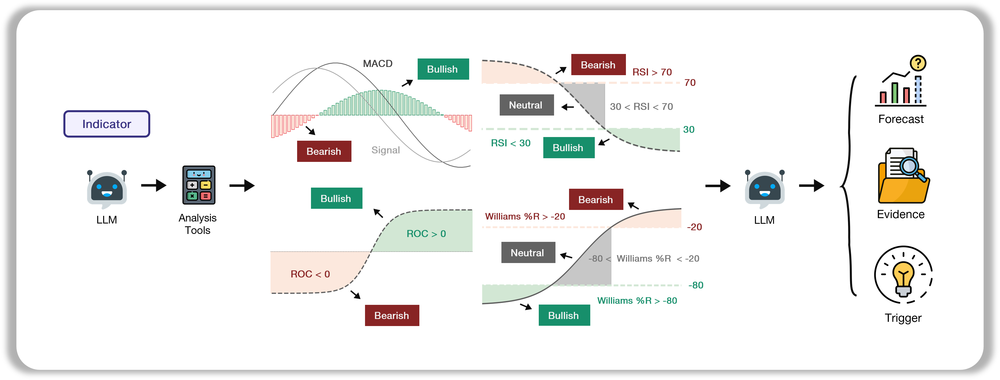
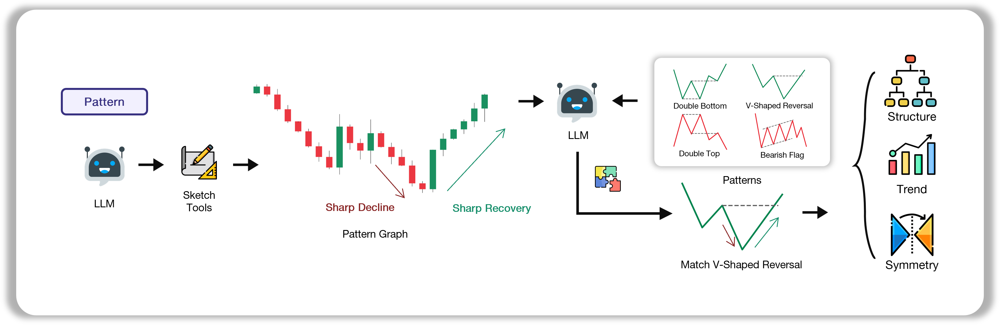
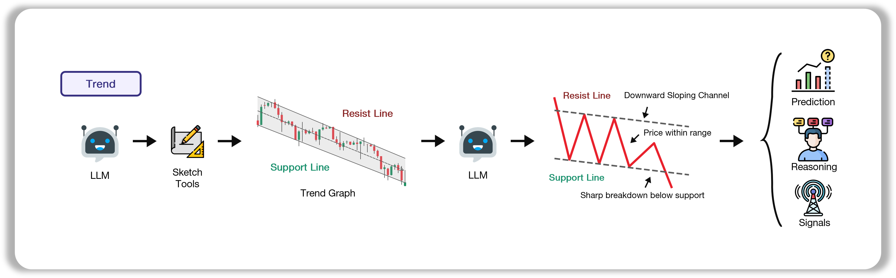
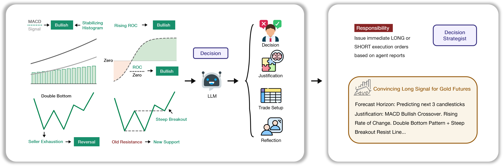
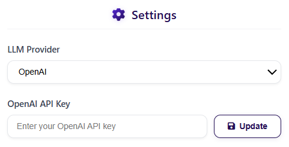

<div align="center">


<h2>QuantAgent: Price-Driven Multi-Agent LLMs for High-Frequency Trading</h2>

</div>


<div align="center">

<div style="position: relative; text-align: center; margin: 20px 0;">
  <div style="position: absolute; top: -10px; right: 20%; font-size: 1.2em;"></div>
  <p>
    <a href="https://machineily.github.io/">Fei Xiong</a><sup>1,2 ★</sup>&nbsp;
    <a href="https://wyattz23.github.io">Xiang Zhang</a><sup>3 ★</sup>&nbsp;
    <a href="https://scholar.google.com/citations?user=hFhhrmgAAAAJ&hl=en">Aosong Feng</a><sup>4</sup>&nbsp;
    <a href="https://intersun.github.io/">Siqi Sun</a><sup>5</sup>&nbsp;
    <a href="https://chenyuyou.me/">Chenyu You</a><sup>1</sup>
  </p>
  
  <p>
    <sup>1</sup> Stony Brook University &nbsp;&nbsp; 
    <sup>2</sup> Carnegie Mellon University &nbsp;&nbsp;
    <sup>3</sup> University of British Columbia &nbsp;&nbsp; <br>
    <sup>4</sup> Yale University &nbsp;&nbsp; 
    <sup>5</sup> Fudan University &nbsp;&nbsp; 
    ★ Equal Contribution <br>
  </p>
</div>

<div align="center" style="margin: 20px 0;">
  <a href="README.md">English</a> | <a href="README_CN.md">中文</a>
</div>

<br>
<p align="center">
  <a href="https://arxiv.org/abs/2509.09995">
    
  </a>
  <a href="https://Y-Research-SBU.github.io/QuantAgent">
    
  </a>
  <a href="https://github.com/Y-Research-SBU/QuantAgent/blob/main/assets/wechat_1207.jpg">
    
  </a>
  <a href="https://discord.gg/t9nQ6VXQ">
    
  </a>
</p>

</div>


A sophisticated **multi-agent conversational trading analysis system** that combines technical indicators, pattern recognition, and trend analysis using LangChain and LangGraph. The system maintains persistent analysis cache, tracks conversation history, and provides intelligent routing with automatic staleness detection.

**Key Features:**
- 🤖 **Conversational Multi-Turn Interface** - Natural language queries with context retention
- 💾 **Persistent Analysis Caching** - Avoids re-computing fresh analysis
- 🔄 **Automatic Staleness Detection** - Intelligently reruns outdated analysis
- 🎯 **Unified Dialogue Agent** - Single adaptive prompt for all query types
- 🌐 **Web Interface + CLI** - Both interactive terminal and Flask web UI

<div align="center">

🚀 [Features](#-features) | ⚡ [Installation](#-installation) | 🎬 [Usage](#-usage) | 🏗️ [Architecture](#-architecture) | 🔧 [Implementation](#-implementation) | 🤝 [Contributing](#-contributing) | 📄 [License](#-license)

</div>

## 🚀 Features

### 🎯 **Core System**

- **Conversational Interface** - Multi-turn conversations with full context retention
- **Persistent Analysis Store** - Cached results across queries for speed
- **Automatic Freshness Tracking** - Each agent tracks `ran_at` timestamps
- **Intelligent Staleness Detection** - Decision agent auto-reruns when upstream data changes
- **Graceful Error Handling** - Handles failed data fetches with clear error messages
- **Dual Context System** - Separate data contexts for analysis vs. dialogue

### 🤖 **Specialized Agents**

#### 1. **Planner Agent**
- Interprets user intent (`trade`, `trend`, `compare`, `explain`, `price_check`)
- Determines required analyses and data contexts
- Enforces Yahoo Finance API limits (1m: 4 days, 5m: 30 days, 15m: 60 days)
- Computes datetime ranges with timezone awareness

#### 2. **Validator**
- Pure Python safety gate (no LLM)
- Validates completeness (symbol, timeframe, datetime ranges)
- Ensures horizon consistency across contexts
- Enforces fair comparisons (same timeframe for all assets)
- Blocks execution on incomplete information

#### 3. **Indicator Agent**
- Computes RSI, MACD, Stochastic Oscillator, Bollinger Bands
- Freshness check: 1 candle tolerance
- Updates only indicator field in analysis_store

  
  
#### 4. **Pattern Agent**
- Identifies 13+ chart patterns (head & shoulders, triangles, flags, etc.)
- Uses vision-capable LLM to analyze generated charts
- Freshness check: 2-3 candles tolerance
- Updates only pattern field in analysis_store
  
  
  
#### 5. **Trend Agent**
- Fits trend channels (support/resistance lines)
- Analyzes slope, consolidation zones, breakouts
- Freshness check: % of analysis window
- Updates only trend field in analysis_store
  
  

#### 6. **Decision Agent**
- Synthesizes indicator + pattern + trend outputs
- Non-conversational, produces structured JSON only
- **Automatic staleness detection** - reruns if upstream agents updated
- Tolerance: 15min (intraday), 6h (swing), 3d (long_term)
  
  

#### 7. **Dialogue Agent**
- **Unified conversational prompt** - adapts to any query type
- Reads analysis_store + data_contexts_required
- Never changes decisions or runs analysis
- Provides graceful error messages for failed fetches

### 🌐 **Interfaces**

#### **Web Interface** (Flask)
- Real-time market data from Yahoo Finance
- Interactive asset selection (stocks, crypto, commodities, indices)
- Multiple timeframe analysis (1m, 5m, 15m, 1h, 1d)
- API key management
- Dynamic chart generation

#### **CLI Interface** (`test_interactive.py`)
- Multi-turn conversational loop
- Persistent state across queries
- Auto-cleanup on exit (clears `output/charts/`, `debug_output/`)
- Debug mode with state inspection

## 📦 Installation

### 1. Create and Activate Conda Environment

```bash
conda create -n quantagents python=3.11
conda activate quantagents
```

### 2. Install Dependencies

```bash
pip install -r requirements.txt
```

If you encounter issues with TA-lib-python, 
try

```bash
conda install -c conda-forge ta-lib
```

Or visit the [TA-Lib Python repository](https://github.com/ta-lib/ta-lib-python) for detailed installation instructions.

### 3. Set Up LLM API Key
You can set it in our Web InterFace Later,



Or set it as an environment variable:
```bash
# For OpenAI
export OPENAI_API_KEY="your_openai_api_key_here"

# For Anthropic (Claude)
export ANTHROPIC_API_KEY="your_anthropic_api_key_here"

# For Qwen (DashScope, based in Singapore — delays may occur)
export DASHSCOPE_API_KEY="your_dashscope_api_key_here"

```


## 🚀 Usage

### Option 1: Interactive CLI (Recommended for Testing)

```bash
python test_interactive.py
```

**Features:**
- Multi-turn conversational interface
- Persistent analysis cache across queries
- Auto-cleanup on exit (`q`, `quit`, `exit`)
- State inspection and debugging

**Example queries:**
```
👤 You: Should I buy AAPL for intraday?
👤 You: What about the 15-minute timeframe?
👤 You: Compare AAPL and MSFT on daily
👤 You: Explain the RSI indicator
👤 You: What was the price of BTC yesterday?
```

### Option 2: Web Interface

```bash
python web_interface.py
```

Access at `http://127.0.0.1:5000`

**Features:**
- Interactive asset selection
- Timeframe picker (1m, 5m, 15m, 1h, 1d)
- Custom date ranges
- Visual chart generation
- API key management

## 📺 Demo


## 🏗️ Architecture

### System Flow

```
START → normalize → planner → validator → fetch → 
indicator → pattern → trend → decision → dialogue → 
memory → cleanup → END
```

**Key Design:**
- **Sequential execution** - Agents run in order
- **Conditional execution** - Each agent checks freshness internally
- **State propagation** - Full state passed through each node
- **Persistent fields** - `analysis_store`, `conversation_summary` kept across queries
- **Temporary fields** - `kline_data`, `user_query`, `intent` cleared after each turn

### Files Structure

**Production Files (Use These):**
```
graph_main.py              - Main orchestration (TradingGraphV2)
agent_state.py             - TypedDict state definition
planner_agent.py           - Query interpretation + validation
*_agent_new.py             - Analysis agents with caching
  ├─ indicator_agent_new.py
  ├─ pattern_agent_new.py
  ├─ trend_agent_new.py
  └─ decision_agent_new.py
dialogue_agent.py          - Unified conversational agent
conversation_memory.py     - Memory management
decision_freshness.py      - Staleness detection logic
analysis_store_util.py     - Cache utilities
freshness_config.py        - Freshness tolerance config
test_interactive.py        - CLI interface
```

**Obsolete Files (Can Delete):**
```
graph_setup.py             - Old routing
*_agent.py (without _new)  - Old agents without caching
test_api.py, test_b.py     - Legacy tests
```

**Web Interface Only:**
```
graph_setup_new.py         - Legacy adapter for web UI
web_interface.py           - Flask app
trading_graph.py           - LLM initialization wrapper
```

## 🔧 Implementation

### Python API Usage

**Main Entry Point: `graph_main.py`**

```python
from graph_main import create_trading_graph

config = {
    "agent_llm_provider": "openai",
    "agent_llm_model": "gpt-4o-mini",
    "graph_llm_provider": "openai", 
    "graph_llm_model": "gpt-4o",
    "agent_llm_temperature": 0.1,
    "openai_api_key": "your-key-here"
}

# Create graph
graph = create_trading_graph(config)

# First query
state = {
    "user_query": "Should I buy AAPL for intraday?",
    "analysis_store": {},
    "conversation_summary": ""
}

result = graph.invoke(state)
print(result["explanation"])

# Follow-up query (reuses cache)
state["user_query"] = "What about swing trading?"
state["analysis_store"] = result["analysis_store"]  # Persist cache
state["conversation_summary"] = result["conversation_summary"]

result2 = graph.invoke(state)
print(result2["explanation"])
```

### Configuration Options

**Supported Providers:**
- `agent_llm_provider`: `"openai"`, `"anthropic"`, `"gemini"`, `"qwen"`
- `graph_llm_provider`: Same as above

**Model Selection:**
- `agent_llm_model`: Model for analysis agents (e.g., `"gpt-4o-mini"`, `"claude-sonnet-4"`)
- `graph_llm_model`: Model for planner/routing (e.g., `"gpt-4o"`, `"gemini-2.0-flash-exp"`)

**Temperature:**
- `agent_llm_temperature`: Response creativity (default: `0.1`)
- `graph_llm_temperature`: Planning creativity (default: `0.1`)

**Important Notes:**
- Pattern and Trend agents require **vision-capable models** (e.g., `gpt-4o`, `claude-sonnet-4`, `gemini-2.0-flash`)
- Indicator and Decision agents work with text-only models
- See `default_config.py` for full configuration options

### Freshness Tolerance Configuration

**Indicator Agent:** 1 candle  
**Pattern Agent:** 2-3 candles (horizon-dependent)  
**Trend Agent:** % of analysis window  
**Decision Agent:**
- Intraday: 15 minutes
- Swing: 6 hours
- Long-term: 3 days

Configure in `freshness_config.py`

## 🤝 Contributing

1. Fork the repository
2. Create a feature branch
3. Make your changes
4. Add tests if applicable
5. Submit a pull request

## 📄 License

This project is licensed under the MIT License - see the LICENSE file for details.

## 🔖 Citation
```
@article{xiong2025quantagent,
  title={QuantAgent: Price-Driven Multi-Agent LLMs for High-Frequency Trading},
  author={Fei Xiong and Xiang Zhang and Aosong Feng and Siqi Sun and Chenyu You},
  journal={arXiv preprint arXiv:2509.09995},
  year={2025}
}
```


## 🙏 Acknowledgements

This repository was built with the help of the following libraries and frameworks:

- [**LangGraph**](https://github.com/langchain-ai/langgraph)
- [**OpenAI**](https://github.com/openai/openai-python)
- [**Anthropic (Claude)**](https://github.com/anthropics/anthropic-sdk-python)
- [**Qwen**](https://github.com/QwenLM/Qwen)
- [**yfinance**](https://github.com/ranaroussi/yfinance)
- [**Flask**](https://github.com/pallets/flask)
- [**TechnicalAnalysisAutomation**](https://github.com/neurotrader888/TechnicalAnalysisAutomation/tree/main)
- [**tvdatafeed**](https://github.com/rongardF/tvdatafeed)
## ⚠️ Disclaimer

This software is for educational and research purposes only. It is not intended to provide financial advice. Always do your own research and consider consulting with a financial advisor before making investment decisions.

## 🐛 Troubleshooting

### Common Issues

1. **TA-Lib Installation**
   ```bash
   # Windows/Mac/Linux
   conda install -c conda-forge ta-lib
   ```
   Or see [official repository](https://github.com/ta-lib/ta-lib-python)

2. **LLM API Key Issues**
   - Set as environment variable OR through web interface
   - Verify key has sufficient credits
   - Check provider is spelled correctly in config

3. **Data Fetching Failures**
   - **Yahoo Finance limits:**
     - 1m: max 4 days lookback
     - 5m: max 30 days lookback
     - 15m: max 60 days lookback
   - Some symbols unavailable (delisted, wrong suffix)
   - Indian stocks: use `.NS` (NSE) or `.BO` (BSE) suffix
   - System handles failures gracefully with error messages

4. **"No explanation generated" Error**
   - Fixed in current version - cleanup node no longer clears explanation
   - If still occurs, check dialogue agent returns state with `explanation` field

5. **Stale Analysis Not Updating**
   - Check `decision_freshness.py` tolerance settings
   - Verify `ran_at` timestamps in `analysis_store`
   - Decision agent should auto-detect staleness

### Debug Mode

Enable detailed logging in `test_interactive.py`:
```python
# Shows all result keys and explanation preview
print(f"🔍 DEBUG - Result keys: {list(result.keys())}")
```

### Support

If issues persist:
1. Check error messages in console/terminal
2. Verify all dependencies installed: `pip list | grep -E "langchain|openai|yfinance"`
3. Ensure correct Python version: `python --version` (3.11 recommended)
4. Clear cache: delete `debug_output/` and `output/charts/` folders

## 📧 Contact

For questions, feedback, or collaboration opportunities, please contact:

**Email**: [chenyu.you@stonybrook.edu](mailto:chenyu.you@stonybrook.edu), [siqisun@fudan.edu.cn](mailto:siqisun@fudan.edu.cn)


## Star History

[](https://www.star-history.com/#Y-Research-SBU/QuantAgent&Date)
